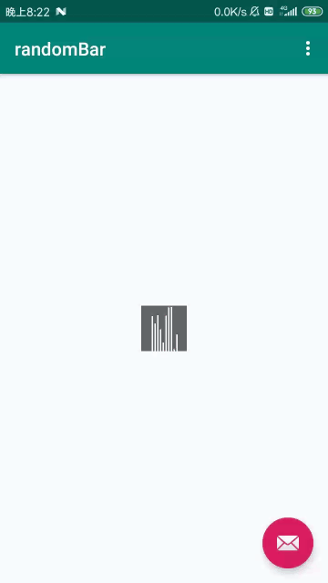

# RandomBar
RandomBar


### RandomBar sample
 </img>

## Build

Add the following to your app's build.gradle:

```groovy
	dependencies {
	        implementation 'com.github.futureLix:RandomBar:v1.0'
	}
```
## How to use


#### Add the following XML:

```xml
    <com.audio.random.RandomBar
        android:id="@+id/random"
        android:layout_width="20dp"
        android:layout_height="20dp"
        android:background="@color/black_60"
        app:RandomBarColor="@color/white"
        app:RandomBarDelayTime="100"
        app:RandomBarNum="10"
        app:RandomBarWidth="3dp" />
```


#### Create :

```java

        RandomBar randomBar = findViewById(R.id.random);
        randomBar.setRandomBarNum(10);
        randomBar.start();
```
